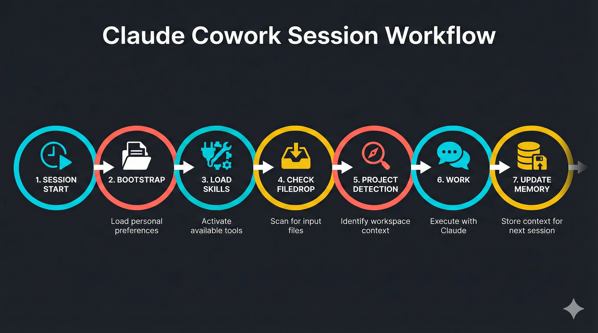

# Claude Cowork Template — AI Productivity Workspace

A production-ready workspace template for Claude Cowork — file organization, task management, memory systems, and multi-session conversation continuity for productive AI-assisted work.

Get the same kind of functionality as OpenClaw (formerly Clawdbot) — skills, memory, task management — but without the security risks of self-hosting. This runs entirely inside Anthropic's first-party Claude desktop app. No API keys to manage, no third-party infrastructure, no attack surface to worry about.

> **Requires:** [Claude Max or Team subscription](https://claude.ai) (Cowork is a Claude desktop app feature)

## Quick Start

1. **Clone this repo** to your computer
   ```bash
   git clone https://github.com/helgejo/cowork-template.git
   ```
2. **Point Claude Cowork to the folder** — in the Claude desktop app, select `cowork-template` as your working folder
3. **Tell Claude to initialize:**
   > "Read CLAUDE.md and initialize my workspace. Ask me questions about my company, work categories, and preferences so you can set everything up for me."

Claude will read the template, ask you what you need, create your work categories, populate `company-context/` with your company info, and customize `CLAUDE.md` to fit your workflow. From then on, use this same folder for all your work — Claude remembers everything across sessions.

---

## What Is Claude Cowork?

Claude Cowork is an AI workspace system for organizing long-term AI-assisted work across multiple conversations in the Claude desktop app. Unlike a single-session chat, this workspace template creates permanent structure for:

- **Multi-session continuity** — Save conversation context in `CONTEXT.md`, pick up where you left off
- **File organization** — Work stays organized by category, date, and project
- **Memory persistence** — Build company knowledge once, reuse it across projects
- **Task management** — Track all active work, resources, and completed projects
- **Read-only sources** — Reference originals without modifying them
- **Automatic filing** — Drop files in `filedrop/`, Claude organizes them for you

This template gives you a proven structure that scales from solo work to team collaboration.

---

## Workspace Architecture

Claude Cowork uses a **layered memory system** to keep context across AI conversations:

```
┌─────────────────────────────────────────────┐
│ CONTEXT.md (per-task conversation memory)   │
├─────────────────────────────────────────────┤
│ system/memory/ (evolving context)           │
│  - people/ (contacts)                       │
│  - projects/ (deep project knowledge)       │
│  - context/ (decisions, data)               │
├─────────────────────────────────────────────┤
│ work/INDEX.md (master file index)           │
├─────────────────────────────────────────────┤
│ company-context/ (skills + shared knowledge)│
│  - glossary.md (terms & acronyms)           │
│  - brand/, product/, process guides         │
├─────────────────────────────────────────────┤
│ CLAUDE.md (bootstrap + where-to-find things)│
├─────────────────────────────────────────────┤
│ wrk-rules skill (workspace conventions)     │
└─────────────────────────────────────────────┘
```

**Key insight:** Every layer has a purpose. CLAUDE.md tells you where to look. Skills hold stable knowledge. Memory holds evolving knowledge. CONTEXT.md carries conversation forward.


---

## Folder Structure Overview

```
your-workspace/
├── CLAUDE.md                    # Read this first — bootstrap & initialization
├── TASKS.md                     # All your active tasks at a glance
├── filedrop/                    # Drop files here; Claude organizes them
├── work/                        # All your work content
│   ├── INDEX.md                 # Master index of files & projects
│   ├── your-category/           # Work organized by category
│   │   ├── _resources/          # Persistent resources, templates, logs
│   │   ├── YYYY-MM-DD_task-1/   # Task folder
│   │   │   ├── CONTEXT.md       # ← Conversation memory
│   │   │   ├── deliverable.pdf
│   │   │   └── notes.md
│   │   ├── YYYY-MM-DD_task-2/
│   │   └── _archive/            # Completed tasks
│   ├── another-category/
│   └── original-source-files/   # Read-only reference originals
├── personal/                    # Personal files
│   └── INDEX.md
├── company-context/             # Your company knowledge base
│   ├── README.md                # Guide for organizing company knowledge
│   ├── glossary.md              # Terms, acronyms, integrations
│   ├── brand/                   # Brand guidelines
│   ├── product/                 # Product info
│   └── people/                  # Team directory
└── system/                      # Claude internals
    ├── CHANGELOG.md             # Append-only change log
    ├── memory/
    │   ├── people/              # Contact profiles
    │   ├── projects/            # Deep project context
    │   └── context/             # Evolving knowledge
    ├── Skills/
    │   └── wrk-rules/SKILL.md   # Workspace rules (load at session start)
    ├── docs/                    # Working documents
    └── archive/                 # Archived changelogs & old data
```

---

## How to Set Up Your AI Workspace

### 1. Copy the Template

```bash
git clone <this-repo> my-cowork-workspace
cd my-cowork-workspace
```

Or download as ZIP and extract.

### 2. Read CLAUDE.md

```
CLAUDE.md = your workspace bootstrap
```

It tells Claude how to start each session. It's short (~45 lines) and stable.

### 3. Load wrk-rules

Each session, load `Skills/wrk-rules/SKILL.md`. This skill contains:
- File naming conventions
- Task folder structure
- Conversation memory (CONTEXT.md) rules
- Filedrop inbox workflow
- Memory system (no duplication across layers)
- Archive policy

### 4. Create Your First Task

```
work/[your-category]/2026-02-10_[task-name]/
├── CONTEXT.md                  # Create this immediately
├── deliverable-one.pdf
└── notes.md
```

**CONTEXT.md template:**
```markdown
# [Task Name]

## Summary
One-paragraph description of what this task is about.

## Status
in-progress / blocked / ready-for-review / done

## Key Decisions
- [Date]: Decision made and rationale

## Current State
What was accomplished, what's next, any blockers.

## Files in This Folder
- filename.ext — what it is

## Open Questions
Things that still need resolution.
```

This file allows you to start a new Claude conversation, share CONTEXT.md, and pick up exactly where you left off.

### 5. Add Company Knowledge

Create `company-context/glossary.md`:

```markdown
# Company Glossary

## Terms
- **Acronym** — What it stands for, what it means
- **Term** — Definition in 1-2 sentences

## People
- **Name** — Role, contact info if relevant

## Integrations
- **Tool** — Why we use it, who owns it
```

Add more files as needed: `brand/`, `product/`, `processes/`, etc.

### 6. Customize Work Categories

Replace `your-category` with your actual categories. Examples:
- `marketing/` — campaigns, content, analytics
- `product/` — specs, roadmap, design
- `engineering/` — code projects, infrastructure
- `sales/` — proposals, decks, playbooks
- `operations/` — processes, documentation, tools

Create a `_resources/` folder in each category for persistent resources that span multiple tasks.

### 7. Set Up Filedrop Inbox

Drop files in `filedrop/`. On session start, Claude will:
- Organize files to `work/original-source-files/`
- Update `work/INDEX.md`
- Log in `system/CHANGELOG.md`

---

## Key Features of Claude Cowork


### 1. Multi-Session Continuity

Save conversation context in `CONTEXT.md`. Next session:

```
Claude: "I see you're working on [project]. Your last status was: [summary from CONTEXT.md]. What's next?"
```

No more context-switching. You pick up exactly where you left off.

### 2. Task Folders with CONTEXT.md

Every task gets its own folder:

```
work/marketing/2026-02-10_landing-page-redesign/
├── CONTEXT.md                           # ← Conversation memory
├── 2026-02-10_spec-landing-page.md
├── 2026-02-10_design-mockups.pdf
└── 2026-02-10_feedback-from-stakeholders.md
```

The folder date tells you when work started. Files inside drop the date (it's redundant). CONTEXT.md carries the conversation.

### 3. File Naming Convention

```
YYYY-MM-DD_[type]-[subject]-[detail].ext

Examples:
2026-02-10_prop-sales-deck-q1.pptx
2026-02-10_rpt-marketing-performance-jan.pdf
2026-02-10_spec-api-endpoints.md
```

Type codes: `prop`, `rpt`, `mtg`, `spec`, `plan`, `pres`, `brief`, `tmpl`, `guide`, `draft`, `email`, `model`, `dash`.

### 4. Read-Only Sources

Drop reference originals in `work/original-source-files/`:

```
work/original-source-files/
├── financials/
│   └── 2025_annual_budget.xlsx
├── brand/
│   └── brand_guidelines_v3.pdf
├── customers/
│   └── customer_list_2025.csv
└── legal/
    └── service_agreement_v2.docx
```

Never modify originals. When a source updates, archive the old version and add the new one.

### 5. Company Knowledge Base

`company-context/` is your single source of truth:

```
company-context/
├── README.md                    # How to organize this folder
├── glossary.md                  # Terms, acronyms, integrations
├── brand/                       # Brand guidelines
│   ├── logo_usage.md
│   ├── tone_and_voice.md
│   └── visual_guidelines.md
├── product/                     # Product documentation
│   ├── overview.md
│   ├── features.md
│   └── roadmap.md
└── processes/                   # How you work
    ├── decision_making.md
    └── team_structure.md
```

Claude references this across all projects. Update once, benefit everywhere.

### 6. Changelog with Rotation

`system/CHANGELOG.md` is append-only and reverse chronological:

```
# Changelog

## 2026-02-10

### Added
- Created landing page redesign task folder
- Archived completed email campaign task

### Changed
- Updated brand guidelines in company-context/

### Archived
- 2026-01-31_email-campaign/ → moved to _archive/

### Notes
- Rotating changelog to archive (entries older than 2 weeks)
```

Every 2 weeks, move old entries to `system/archive/changelog-history.md`.

### 7. Memory System (No Duplication)

Each layer has a purpose:

| Layer | Use For | How Often? |
|-------|---------|-----------|
| `wrk-rules` skill | Workspace conventions | Rarely change |
| `CLAUDE.md` | Bootstrap + where to find things | When structure changes |
| `company-context/` | Brand, product, glossary | As product evolves |
| `work/INDEX.md` | File inventory | When files added |
| `TASKS.md` | Task list | Every session |
| `system/memory/` | Evolving context (decisions, people, numbers) | Every session |
| `CONTEXT.md` | Per-task conversation memory | Every conversation |

This prevents duplication and keeps each layer focused.

---

## How to Customize Your Workspace

### Add New Work Categories

Create a new folder under `work/`:

```bash
mkdir -p work/your-new-category/_resources
mkdir -p work/your-new-category/_archive
```

Update `CLAUDE.md` to list the new category in the "Where to Find Things" table if needed.

### Create Company Skills

Company knowledge can also live in `Skills/` as reusable skills. Example:

```
Skills/
├── wrk-rules/SKILL.md           # Workspace conventions (included)
├── brand/SKILL.md               # Brand guidelines as a skill
├── product/SKILL.md             # Product overview as a skill
└── glossary/SKILL.md            # Company glossary as a skill
```

Skills are best for information that doesn't change often and is used across many tasks.

### Add More Memory Folders

`system/memory/` currently has `people/`, `projects/`, and `context/`. Add more:

```
system/memory/
├── people/                      # Contact profiles
├── projects/                    # Project context
├── context/                     # Decisions, financials
├── customers/                   # Customer profiles
└── integrations/                # How external tools work
```

### Integrate with Version Control

This template is git-friendly:

```bash
git init
git add .
git commit -m "Initial workspace setup"
```

Commit regularly. Avoid committing:
- Sensitive data (API keys, passwords, PII)
- Large files (use `original-source-files/` for reference)
- `.DS_Store`, `*.tmp`, etc. — use `.gitignore`

---

## Skills & MCP Connectors

Claude Cowork works with specialized AI tools:

### Skills
Skills are reusable knowledge uploaded once, used everywhere. This template includes:
- **wrk-rules** — Workspace conventions (included)

Create your own:
- **Company Brand** — Tone, messaging, visual identity
- **Product Guide** — What you build, how it works
- **Glossary** — Company terms and acronyms
- **Process Guide** — How you make decisions, ship work

### Connectors (MCP)
Connectors integrate external tools:
- **GitHub** — Manage code repos, create issues
- **Jira** — Track tasks and sprints
- **Slack** — Send messages, read channels
- **Google Drive** — Access shared documents
- **Salesforce** — Query customer data
- **HubSpot** — Manage leads and deals
- And many more...

Check available connectors in your Claude setup and use them in your work.

---

## Workspace Rules Summary

### File Organization
- Never delete — always archive
- Task folders: `work/[category]/YYYY-MM-DD_[task-name]/`
- File naming: `YYYY-MM-DD_[type]-[subject].ext`
- Read-only originals in `work/original-source-files/`
- Resources in `_resources/`, completed tasks in `_archive/`

### Conversation Memory
- Create `CONTEXT.md` in every task folder
- Update it at the end of each session
- It's your primary way to carry context between conversations

### Company Knowledge
- Single source of truth in `company-context/`
- Glossary, brand, product, processes — whatever you need
- Don't duplicate company knowledge in memory or skills

### Task Management
- All tasks live in `TASKS.md`
- Sections: Active, Backlog, Recurring, Waiting, Done
- Move tasks between sections as they progress

### Filedrop Inbox
- Drop files in `filedrop/`
- Claude organizes them to `work/original-source-files/`
- Update `work/INDEX.md` and log in `system/CHANGELOG.md`

### Changelog
- Append-only, reverse chronological
- Sections: Added, Changed, Archived, Notes
- Rotate every 2 weeks to `system/archive/changelog-history.md`

---

## Example AI Workflow



### Day 1: Start a New Project

```
1. Read CLAUDE.md
2. Load wrk-rules skill
3. Check filedrop/ — empty
4. Create task folder:
   work/marketing/2026-02-10_email-campaign-launch/
5. Create CONTEXT.md with summary
6. Start work, save files in the task folder
7. At session end: Update CONTEXT.md with current state
```

### Day 2: Continue the Project

```
1. Read CLAUDE.md
2. Load wrk-rules skill
3. Read work/INDEX.md — see the email campaign task
4. Ask user: "Continue email campaign?"
5. User says yes
6. Read CONTEXT.md — restore full context
7. Continue where we left off
8. At session end: Update CONTEXT.md again
```

### Day 5: Archive Completed Project

```
1. Task is done
2. Update CONTEXT.md with final status
3. Move folder to work/marketing/_archive/
4. Update work/INDEX.md (move from active to archive)
5. Log in system/CHANGELOG.md
6. Confirm to user: "Archived [task-name]"
```

---

## Troubleshooting

### "Where do I put this file?"

Check `CLAUDE.md` → "Where to Find Things" table. If it's a task deliverable, it goes in the task folder. If it's a reference, it goes in `work/original-source-files/`. If it's company knowledge, it goes in `company-context/`.

### "How do I add a new work category?"

Create `work/your-category/` with `_resources/` and `_archive/` subfolders. Tasks go directly in the category folder.

### "What if I want to change the structure?"

You can. Update `CLAUDE.md` and `wrk-rules/SKILL.md` to reflect the new structure. Then log the change in `system/CHANGELOG.md`.

### "How do I share company knowledge with my team?"

Put it in `company-context/` and commit to git. Team members clone or pull to get the latest.

### "Should I version control everything?"

Yes, except:
- Large binaries (use links or references instead)
- Sensitive data (API keys, passwords, PII)
- Generated/temporary files (put in `.gitignore`)

---

## Claude Cowork vs OpenClaw / Clawdbot

Tools like OpenClaw (formerly Clawdbot) offer similar concepts — skills, memory, multi-session workflows. They're impressive open-source projects. But they require you to self-host, manage API keys, and maintain infrastructure. Unless you know exactly what you're doing, that's a real security risk: your company data flows through third-party code you're responsible for auditing and updating.

This template gives you the same productivity architecture — but running entirely inside Claude's first-party desktop app. Anthropic handles security, model updates ship immediately, and your files never leave your machine. The trade-off is you need a Claude Max subscription and you lose some customization depth. For most founders and knowledge workers, that's the right trade.

---

## License

This template is provided as-is. Use, modify, and share freely.

---

## Questions or Feedback?

This template is designed to scale from solo work to team collaboration. If you find it useful, please share it with others. If you improve it, consider contributing back.

Happy working!
